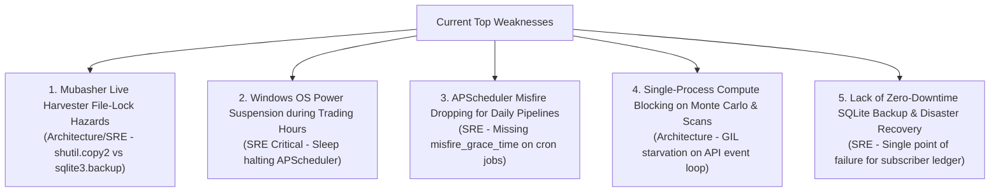

# Layer 1: Executive Summary & Enhancement Roadmap (Audit V2)

**Lead Author:** `orchestrator` (Hermes Swarm)  
**Contributors:** `technical-architect`, `security-engineer`, `site-reliability-engineer`  
**System:** Horus Analytics II (`c:\Users\TSabr\Horus\Horus-Analytics-II`)  
**Audit Baseline:** Post-Phase 0 (Concurrency & Security), Phase 1 (SystemMonitor Consolidation), and Phase 2 (SLA Telemetry & Watchdog)  
**Operational Profile:** **Single-Operator Local Terminal & Commercial Signal Distribution Station**  
*(Admin-only desktop installation; proprietary signal generation & Telegram broadcasting to paying subscribers)*

---

## 1. Audit Context & Current System Baseline

Following the successful execution of **Phase 0**, **Phase 1**, and **Phase 2**, Horus Analytics II has undergone a major stability transformation:

| Domain | Historical Baseline | Current State (Post Phase 0-2) | Verification |
| :--- | :--- | :--- | :--- |
| **Test Suite** | 98 failing tests | **250 / 250 tests PASSED (100% Green)** | Zero regressions across 17 backend suites |
| **Database Concurrency** | SQLite lock contention & 5.2MB error cascades | **WAL mode, busy_timeout=30s, atomic write retry** | Startup race fixed, zero `signalguardstate` errors |
| **Position Monitoring** | Duplicate loops in legacy AutoTrader + monitor | **Unified in `SystemMonitor.monitor_system_positions`** | All SYSTEM & Horus portfolios monitored |
| **Signal Delivery SLA** | Blind Telegram dispatch without latency tracking | **`SignalDelivery.latency_ms`, SLA metrics API (`/sla`)** | Sub-millisecond round-trip telemetry recorded |
| **Feed Stalls** | Silent stalls during EGX market hours | **`MarketFeedWatchdog` self-healing & 15m alert cooldown** | Auto-invalidation, incremental sync, admin alerts |

With these foundational fixes in place, this **V2 Audit** shifts focus from emergency firefighting to **resilience, feed concurrency, operating system durability, and long-term signal generation uptime**.

---

## 2. The Recalibrated "Executive 5": Current Top Weaknesses

### 1. Mubasher Live Harvester File-Lock Hazards (Architecture & SRE)
- **Finding:** In [`data_engine/mubasher_extractor.py:57-63`](file:///c:/Users/TSabr/Horus/Horus-Analytics-II/data_engine/mubasher_extractor.py#L57-L63), the shadow copy mechanism copies `history.db` and `INTRADAY_MASTER.db` using `shutil.copy2()`.
- **Operational Risk:** If Mubasher Pro Windows client is actively writing to the SQLite database during high-volume trading moments, `shutil.copy2` on Windows raises `[WinError 32] The process cannot access the file because it is being used by another process` or copies a torn/corrupt page. Furthermore, `perform_extraction()` temporarily mutates global `settings.MUBASHER_ROOT_DIR` in-memory, creating thread race hazards against concurrent scan jobs.
- **Recommended Fix:** Replace `shutil.copy2` with `sqlite3`'s native online backup API (`sqlite3.connect(f"file:{live_db}?mode=ro", uri=True).backup(dest_conn)`), and pass shadow paths directly as function parameters rather than mutating global singleton `settings`.

### 2. Windows OS Power Suspension & Sleep Prevention (SRE Critical)
- **Finding:** The admin workstation's Windows OS can enter sleep mode or suspend background network activity if left unattended during the trading session (10:00–14:30 EEST). While a PowerShell keep-alive script exists in `scripts/horus_keepalive.ps1`, it requires manual launch outside the application.
- **Operational Risk:** If the admin locks the workstation or walks away, Windows sleep immediately pauses the Python process. Real-time tick exits, trade monitoring, and scheduled signal dispatches fail completely.
- **Recommended Fix:** Integrate native Windows API execution state keep-alive directly into [`config/lifespan.py`](file:///c:/Users/TSabr/Horus/Horus-Analytics-II/config/lifespan.py) via `ctypes.windll.kernel32.SetThreadExecutionState(0x80000000 | 0x00000001 | 0x00000040)` active during market hours.

### 3. APScheduler Misfire Dropping for Daily Pipelines (SRE)
- **Finding:** In [`config/scheduler_setup.py:102-135`](file:///c:/Users/TSabr/Horus/Horus-Analytics-II/config/scheduler_setup.py#L102-L135), `signal_daily_pipeline` (14:45), `signal_walkforward_validation` (16:30), `wfa_metrics_update` (01:00), and `system_audit` (01:15) have no `misfire_grace_time` set.
- **Operational Risk:** APScheduler defaults to `misfire_grace_time=1` second. If the workstation CPU is temporarily spiked by a browser tab, Excel export, or brief system pause at 14:45:01, APScheduler treats the job as misfired and **completely skips the daily signal run for that day** without retrying.
- **Recommended Fix:** Set explicit `misfire_grace_time=300` and `coalesce=True` across all cron jobs in `config/scheduler_setup.py`.

### 4. Single-Process Compute Blocking on Monte Carlo & Heavy Scans (Architecture)
- **Finding:** CPU-bound analytical tasks (e.g., Ragnarok Monte Carlo simulation in `core/simulation/ragnarok.py`, universe-wide technical indicator calculation across 200+ symbols) execute on standard worker threads sharing the Python GIL with the FastAPI asyncio event loop.
- **Operational Risk:** During heavy scans or simulation runs, the event loop stutters, causing high response latency for live UI queries and delayed WebSocket broadcast ticks.
- **Recommended Fix:** Offload heavy CPU-bound simulation and backfill tasks to a `concurrent.futures.ProcessPoolExecutor` or dedicated background worker process, freeing the main asyncio loop for live feed ticks and Telegram dispatches.

### 5. Lack of Zero-Downtime SQLite Backup & Disaster Recovery (SRE & Data Integrity)
- **Finding:** `horus.db` holds the single authoritative state for subscriber entitlements, portfolio balances, historical performance, and signal audit lifecycles. Currently, there is no automated daily rolling snapshot mechanism.
- **Operational Risk:** A Windows crash, sudden power outage, or drive corruption could compromise `horus.db` without a fast recovery point (RPO = indefinite).
- **Recommended Fix:** Add a lightweight daily post-market SQLite online backup job in APScheduler (at 15:45) copying `horus.db` to `data/backups/horus_YYYYMMDD.db` with a 14-day rolling retention policy.

---

## 3. Security Posture (Calibrated to Admin Terminal)

Since Horus is an admin-operated local workstation tool:
- **Zero Friction Accepted:** Authentication bypass (`HORUS_AUTH_MODE=disabled`) remains acceptable on `127.0.0.1`.
- **Local Hardening Needed:**
  - **Subprocess Sanitization:** In [`data_engine/harvester_service.py:271`](file:///c:/Users/TSabr/Horus/Horus-Analytics-II/data_engine/harvester_service.py#L271), replace `subprocess.run(f"taskkill /F /PID {pid}", shell=True)` with tokenized list `["taskkill", "/F", "/PID", str(int(pid))]` (`shell=False`).
  - **Global Error Sanitization:** Ensure FastAPI unhandled exception middleware strips local filesystem paths and environment tokens before sending error JSON to the browser.
  - **Path Traversal Guards:** Enforce strict filename sanitization on any file upload route (e.g. portfolio Excel imports).

---

## 4. Prioritized Enhancement Roadmap (Phases 3 – 5)

| Phase | Horizon | Focus Area | High-Impact Deliverables |
| :--- | :--- | :--- | :--- |
| **Phase 3: Harvester Durability & OS Sleep Immunity** | Immediate (Days 1–2) | Core Market Stability | • Upgrade `mubasher_extractor.py` to use `sqlite3` online backup API (eliminate `shutil.copy2` and global `settings` mutation). • Embed Windows `SetThreadExecutionState` keep-alive into `lifespan.py` for trading hours (10:00–14:30). • Configure `misfire_grace_time=300` on all scheduler cron jobs. • Fix `taskkill` `shell=True` in `harvester_service.py`. |
| **Phase 4: Disaster Recovery & Automated Snapshots** | Near-Term (Days 3–5) | Data Resilience | • Implement daily automated zero-downtime SQLite online backup job at 15:45 with 14-day rolling pruning. • Add database integrity check (`PRAGMA integrity_check`) to nightly `system_audit`. • Add backup status card to Frontend Status page. |
| **Phase 5: Compute Offloading & Process Isolation** | Medium-Term (Week 2) | Execution Responsiveness | • Offload Ragnarok Monte Carlo simulation and heavy history backfills to `ProcessPoolExecutor`. • Implement universe symbol cache to eliminate duplicate `universe_egx.json` disk reads across scanners. • Add live Telegram delivery latency histogram to Admin SLA dashboard. |

---

## Sources & Deeper Analysis

- **Layer 2 (Specialist Deep Dives):**
  - Technical Architecture: [`02-analysis/technical-architecture.md`](file:///c:/Users/TSabr/Horus/Horus-Analytics-II/docs/audit/hermes-swarm-audit-v2/02-analysis/technical-architecture.md)
  - Security Posture: [`02-analysis/security-posture.md`](file:///c:/Users/TSabr/Horus/Horus-Analytics-II/docs/audit/hermes-swarm-audit-v2/02-analysis/security-posture.md)
  - Site Reliability: [`02-analysis/site-reliability.md`](file:///c:/Users/TSabr/Horus/Horus-Analytics-II/docs/audit/hermes-swarm-audit-v2/02-analysis/site-reliability.md)
- **Layer 3 (Technical Dossiers):**
  - Architecture ADRs: [`03-dossiers/architecture-decision-records.md`](file:///c:/Users/TSabr/Horus/Horus-Analytics-II/docs/audit/hermes-swarm-audit-v2/03-dossiers/architecture-decision-records.md)
  - Vulnerability & Threat Catalog: [`03-dossiers/vulnerability-catalog.md`](file:///c:/Users/TSabr/Horus/Horus-Analytics-II/docs/audit/hermes-swarm-audit-v2/03-dossiers/vulnerability-catalog.md)
  - Reliability & Telemetry Dossier: [`03-dossiers/reliability-telemetry.md`](file:///c:/Users/TSabr/Horus/Horus-Analytics-II/docs/audit/hermes-swarm-audit-v2/03-dossiers/reliability-telemetry.md)
