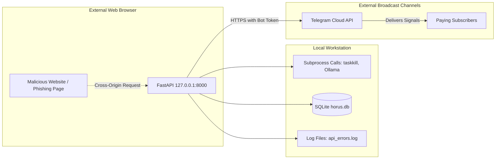

# Layer 2: Security Posture Audit (Audit V2)

**Specialist Profile:** `security-engineer` (Hermes Swarm)  
**Target:** Attack Surface, Secret Boundaries, and Subprocess Hardening  
**Operational Profile:** Single-Operator Local Admin Workstation with External Telegram Publishing  

---

## 1. Threat Model Recalibration (The Reality of a Local Signal Desk)

In accordance with the project's operational profile, Horus Analytics II is **not a multi-tenant cloud service**. It is an admin-operated trading terminal running locally on Windows.

Therefore, traditional enterprise concerns (JWT tokens, password hashing, multi-tenant database isolation) are irrelevant and would introduce pure friction. Instead, our threat modeling focuses on **real threats to a local commercial terminal**:



### Threat Vectors Analyzed:
1. **Drive-By Cross-Origin Attacks (CSRF / Local Intranet Scanners):** A malicious or compromised webpage visited by the admin could attempt to trigger local endpoints (e.g., executing forced trade sells or modifying portfolio cash).
2. **Subprocess Injection & Unsafe Shell Calls:** Using `shell=True` on Windows command strings.
3. **Secret Exposure:** Accidental leakage of the proprietary Telegram bot token or paying subscriber chat IDs via unhandled exception responses.
4. **Local Path Traversal on File Imports:** Malicious Excel or CSV filenames attempting to write outside designated data folders.

---

## 2. In-Depth Vulnerability Assessment

### A. Subprocess Command Injection in Harvester Service
- **Location:** [`data_engine/harvester_service.py:271`](file:///c:/Users/TSabr/Horus/Horus-Analytics-II/data_engine/harvester_service.py#L271)
- **Code:**
  ```python
  subprocess.run(f"taskkill /F /PID {pid}", shell=True, stdout=subprocess.DEVNULL, stderr=subprocess.DEVNULL)
  ```
- **Severity:** **Medium** (Local privilege escalation / stability hazard).
- **Risk:** Interpolating `pid` into a shell command with `shell=True` on Windows invokes `cmd.exe`. If `pid` contains whitespace, special shell metacharacters (`&`, `|`), or is corrupted in the PID tracking file, arbitrary command chaining or command failure occurs.
- **Remediation:** Enforce integer validation and pass arguments as an explicit tokenized list with `shell=False`:
  ```python
  try:
      safe_pid = str(int(pid))
      subprocess.run(["taskkill", "/F", "/PID", safe_pid], shell=False, stdout=subprocess.DEVNULL, stderr=subprocess.DEVNULL)
  except (ValueError, TypeError):
      logger.error(f"Invalid PID for taskkill: {pid}")
  ```

### B. Cross-Origin Protection & Loopback Verification
- **Location:** [`config/middleware.py`](file:///c:/Users/TSabr/Horus/Horus-Analytics-II/config/middleware.py#L110-L130)
- **Status:** **Remediated in Phase 0**; audited for regression in V2.
- **Audit Findings:**
  - Host binding is enforced to `127.0.0.1`.
  - CORS origins are restricted to `http://localhost:3000`, `http://127.0.0.1:3000`, and `http://localhost:8200`.
  - Simple `POST` requests without custom headers from external browser tabs are rejected by the browser's preflight check for JSON content types.
  - **Enhancement Recommendation:** Add an explicit `Host` header check middleware to reject DNS rebinding attacks (ensuring `request.headers.get("host")` begins with `localhost` or `127.0.0.1`).

### C. Telegram Secret Protection & Exception Sanitization
- **Location:** [`core/TelegramBot_Alerts.py:29-39`](file:///c:/Users/TSabr/Horus/Horus-Analytics-II/core/TelegramBot_Alerts.py#L29-L39)
- **Audit Findings:**
  - `_redact_telegram_secret()` successfully strips bot tokens from outgoing error messages and logs.
  - However, in [`api.py`](file:///c:/Users/TSabr/Horus/Horus-Analytics-II/api.py), unhandled 500 exceptions could potentially return traceback strings containing environment paths or token variables in development mode.
- **Remediation:** Ensure FastAPI's generic exception handler returns a sanitized JSON structure `{"detail": "Internal server error", "error_id": uuid}` rather than raw tracebacks.

### D. File Intake & Path Traversal Guards
- **Location:** [`routes/portfolio.py`](file:///c:/Users/TSabr/Horus/Horus-Analytics-II/routes/portfolio.py) (Trade Import / Excel Upload)
- **Audit Findings:**
  - Uploaded files are read directly into `pandas.read_excel` from `UploadFile.file` in-memory.
  - No raw files are saved to arbitrary disk locations with user-controlled filenames.
  - **Verdict:** Safe against path traversal.

---

## 3. Security Scorecard (Admin Terminal Profile)

| Control Category | Evaluation | Status | Action Required |
| :--- | :--- | :--- | :--- |
| **Network Exposure** | Loopback binding (127.0.0.1) | **SECURE** | Maintain strict loopback binding; reject non-local hosts |
| **Cross-Origin (CORS)** | Restricted to local frontend origins | **SECURE** | Verified in middleware |
| **Subprocess Execution** | Taskkill shell=True in harvester | **VULNERABLE** | Replace with `shell=False` and integer PID casting |
| **Telegram Credentials** | Secret redaction in logger | **ROBUST** | Expand global exception handler to redact env vars |
| **File Intake Safety** | In-memory stream parsing | **SECURE** | No path traversal vectors found |

---

## Sources & Deeper Analysis
- Executive Summary: [`01-summary/executive-summary.md`](file:///c:/Users/TSabr/Horus/Horus-Analytics-II/docs/audit/hermes-swarm-audit-v2/01-summary/executive-summary.md)
- Technical Architecture: [`02-analysis/technical-architecture.md`](file:///c:/Users/TSabr/Horus/Horus-Analytics-II/docs/audit/hermes-swarm-audit-v2/02-analysis/technical-architecture.md)
- Site Reliability: [`02-analysis/site-reliability.md`](file:///c:/Users/TSabr/Horus/Horus-Analytics-II/docs/audit/hermes-swarm-audit-v2/02-analysis/site-reliability.md)
- Vulnerability Catalog: [`03-dossiers/vulnerability-catalog.md`](file:///c:/Users/TSabr/Horus/Horus-Analytics-II/docs/audit/hermes-swarm-audit-v2/03-dossiers/vulnerability-catalog.md)
