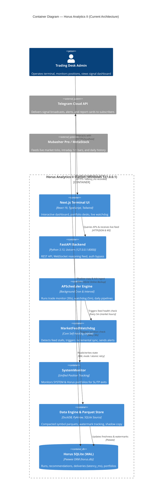

# Layer 2: Technical Architecture Audit (Audit V2)

**Specialist Profile:** `technical-architect` (Hermes Swarm)  
**Target:** Horus Analytics II Backend & Data Pipeline Architecture  
**Context:** Local Terminal & High-Reliability Signal Broadcasting System  

---

## 1. System Architecture Overview (C4 Container Diagram)

The current system post-Phase 0–2 consolidates all data intake, state management, signal generation, and subscriber broadcasting into a clean, unified architecture:



---

## 2. Deep Dive: Ingestion Pipeline & Harvester Concurrency

### A. The Mubasher SQLite Shadow Copy Vulnerability
In [`data_engine/mubasher_extractor.py`](file:///c:/Users/TSabr/Horus/Horus-Analytics-II/data_engine/mubasher_extractor.py), the harvester service runs every 5 minutes during the trading session to ingest intraday bars from Mubasher Pro.

**Current Implementation:**
```python
# data_engine/mubasher_extractor.py:57
shutil.copy2(live_history, shadow_history)
shutil.copy2(live_intraday, shadow_intraday)
```

**Architectural Assessment:**
1. **OS File Locking Hazard:** On Windows NT, SQLite locks database files during active writes using OS-level file handles. When Mubasher Pro updates `INTRADAY_MASTER.db` during high-volume market activity, `shutil.copy2` attempts to acquire a read lock. If Mubasher Pro holds an exclusive lock, Windows raises:
   `[WinError 32] The process cannot access the file because it is being used by another process`
2. **Page Inconsistency (Torn Pages):** Even if the copy succeeds, copying a live SQLite database with OS-level `shutil.copy2` without coordinating through the SQLite VFS can copy partially written database pages, resulting in corrupt shadow databases (`database disk image is malformed`).
3. **Global Configuration Mutation Race Condition:**
   ```python
   # data_engine/mubasher_extractor.py:71-72
   settings.MUBASHER_ROOT_DIR = str(shadow_root)
   settings.MUBASHER_USER_ID = user_id
   ```
   Mutating the singleton `settings` object dynamically while the scheduler is executing background scan threads creates a race condition where other concurrent tasks read the shadow directory instead of the persistent root.

**Target Architecture (Atomic Online Backup):**
Use SQLite's built-in Online Backup API (`sqlite3.backup`):
```python
import sqlite3

def safe_shadow_backup(source_path: Path, dest_path: Path) -> None:
    """Atomic, non-blocking backup of a live SQLite database."""
    # Open source in immutable read-only mode to prevent lock conflicts
    src_uri = f"file:{source_path.as_posix()}?mode=ro&immutable=1"
    with sqlite3.connect(src_uri, uri=True) as src_conn, \
         sqlite3.connect(dest_path) as dst_conn:
        src_conn.backup(dst_conn, pages=100, sleep=0.01)
```
*Benefits:* 100% non-blocking, atomic, zero chance of page tearing, and immune to `WinError 32`.

---

## 3. Execution & Process Model: The Asyncio GIL Bottleneck

### Current State
Horus runs as a single Python process managed by Uvicorn. While asynchronous I/O (`asyncio`) handles web requests and Telegram dispatches efficiently, CPU-intensive operations share the process GIL:
- **Monte Carlo Ruin Simulation (`core/simulation/ragnarok.py`)**: Runs hundreds of simulation iterations across multi-year drawdowns.
- **Universe Daily Technical Scan (`DailyScanner.py`)**: Computes 20+ technical indicators across 200+ symbols.
- **Parquet Compaction (`data_engine/sync.py:compact_folder`)**: Reads, partitions, and rewrites Parquet chunks.

### Architectural Impact
When the admin triggers a manual universe scan or Ragnarok simulation from the UI, worker threads saturate CPU cores. Due to the Python GIL, the main asyncio event loop experiences thread starvation, leading to:
- Dropped WebSocket ping/pong frames to the Next.js frontend.
- API latency spikes on `GET /api/v1/live/status` and `GET /api/v1/signals/desk`.
- Temporary delay in tick processing within `LiveFeedManager`.

### Target Architecture: Process Pool Worker Offloading
Analytical computations should be offloaded to a dedicated `ProcessPoolExecutor`:
```python
from concurrent.futures import ProcessPoolExecutor

_COMPUTE_POOL = ProcessPoolExecutor(max_workers=2)

async def run_heavy_simulation(simulation_params: dict):
    loop = asyncio.get_running_loop()
    return await loop.run_in_executor(_COMPUTE_POOL, execute_simulation_task, simulation_params)
```

---

## 4. Symbol Universe & Exclusions Consolidation

Currently, symbol universe resolution is fragmented across:
1. `config/universe_egx.json` (Static list)
2. `core/exclusions.py` (Blacklisted tickers)
3. `Heimdall.py` (Legacy realm resolution)
4. `data_engine/data_loader.py` (Dynamic discovery from Parquet files)

**Recommendation:** Consolidate universe resolution into a single cached `UniverseRegistry` in `core/universe.py` with in-memory TTL caching (60s) to prevent repeated disk I/O on every tick scan.

---

## Sources & Deeper Analysis
- Executive Summary: [`01-summary/executive-summary.md`](file:///c:/Users/TSabr/Horus/Horus-Analytics-II/docs/audit/hermes-swarm-audit-v2/01-summary/executive-summary.md)
- Security Posture: [`02-analysis/security-posture.md`](file:///c:/Users/TSabr/Horus/Horus-Analytics-II/docs/audit/hermes-swarm-audit-v2/02-analysis/security-posture.md)
- Site Reliability: [`02-analysis/site-reliability.md`](file:///c:/Users/TSabr/Horus/Horus-Analytics-II/docs/audit/hermes-swarm-audit-v2/02-analysis/site-reliability.md)
- Architecture Decision Records: [`03-dossiers/architecture-decision-records.md`](file:///c:/Users/TSabr/Horus/Horus-Analytics-II/docs/audit/hermes-swarm-audit-v2/03-dossiers/architecture-decision-records.md)
