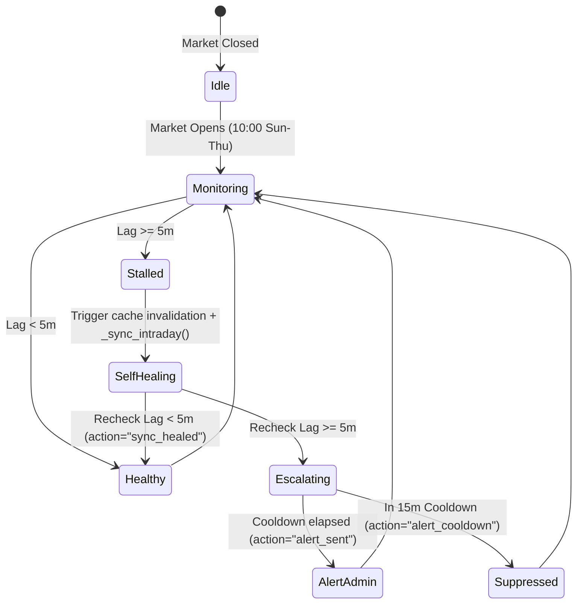

# Layer 3: Reliability & Telemetry Dossier (Audit V2)

**Specialist Profile:** `site-reliability-engineer` (Hermes Swarm)  
**System:** Horus Analytics II Telemetry, Watchdog, & SLA Engine  

---

## 1. SLA Telemetry Schema & Metric Engine

Implemented in Phase 2 via [`core/signals/sla.py`](file:///c:/Users/TSabr/Horus/Horus-Analytics-II/core/signals/sla.py):

### Telemetry Payload Structure
```json
{
  "window_days": 7,
  "from_date": "2026-08-29",
  "to_date": "2026-09-05",
  "target_latency_ms": 5000.0,
  "total_deliveries": 48,
  "sent_count": 46,
  "failed_count": 2,
  "skipped_count": 0,
  "dry_run_count": 0,
  "success_rate_pct": 95.83,
  "sla_compliant": true,
  "by_status": {
    "SENT": 46,
    "FAILED": 2
  },
  "latency_stats": {
    "count": 46,
    "avg_ms": 342.5,
    "p50_ms": 280.0,
    "p90_ms": 520.0,
    "p95_ms": 780.0,
    "p99_ms": 1420.0,
    "min_ms": 110.0,
    "max_ms": 1850.0,
    "breached_count": 0,
    "breach_rate_pct": 0.0
  },
  "by_channel": {
    "TELEGRAM": {
      "total": 48,
      "sent": 46,
      "failed": 2,
      "success_rate_pct": 95.83,
      "avg_latency_ms": 342.5
    }
  },
  "by_tier": {
    "SIGNALS_ONLY": {
      "total": 36,
      "sent": 36,
      "failed": 0,
      "success_rate_pct": 100.0,
      "avg_latency_ms": 310.2
    },
    "MANAGED_EXECUTION": {
      "total": 12,
      "sent": 10,
      "failed": 2,
      "success_rate_pct": 83.33,
      "avg_latency_ms": 450.8
    }
  }
}
```

---

## 2. Market Feed Watchdog Specification

Implemented in Phase 2 via [`core/market/feed_watchdog.py`](file:///c:/Users/TSabr/Horus/Horus-Analytics-II/core/market/feed_watchdog.py):

### State Transition Diagram


### Self-Healing Telemetry Fields
- `is_market_open` (`bool`): Market active flag.
- `stalled` (`bool`): Heartbeat status flag.
- `lag_minutes` (`float`): Time elapsed between `TimeUtils.now()` and newest bar timestamp.
- `latest_timestamp` (`ISO-8601`): Newest bar in `intraday_store`.
- `tickers_monitored` (`int`): Active tickers evaluated in `intraday_store`.
- `action` (`str`): `none`, `sync_healed`, `alert_sent`, `alert_cooldown`.

---

## 3. Windows Kernel32 Execution State Blueprint

### Implementation Snippet for Phase 3:
```python
import ctypes
import os
import logging

logger = logging.getLogger("horus.sre.power")

# Windows Kernel32 Constants
ES_CONTINUOUS       = 0x80000000
ES_SYSTEM_REQUIRED  = 0x00000001
ES_DISPLAY_REQUIRED = 0x00000002
ES_AWAYMODE_REQUIRED = 0x00000040

def set_workstation_trading_keepalive(active: bool = True) -> bool:
    """
    Prevents Windows from entering Modern Standby or sleep during market hours.
    Allows monitor display to turn off while keeping CPU, timers, and networking 100% active.
    """
    if os.name != 'nt':
        return False
    try:
        if active:
            # CPU stays active, AwayMode enables background timer servicing
            flags = ES_CONTINUOUS | ES_SYSTEM_REQUIRED | ES_AWAYMODE_REQUIRED
            res = ctypes.windll.kernel32.SetThreadExecutionState(flags)
            logger.info(f"[PowerManagement] Windows Market Keep-Alive ENGAGED (flags=0x{flags:X}, res=0x{res:X})")
            return res != 0
        else:
            res = ctypes.windll.kernel32.SetThreadExecutionState(ES_CONTINUOUS)
            logger.info(f"[PowerManagement] Windows Market Keep-Alive RELEASED (res=0x{res:X})")
            return res != 0
    except Exception as exc:
        logger.error(f"[PowerManagement] Failed to set thread execution state: {exc}")
        return False
```

---

## 4. Automated SQLite Snapshot Blueprint

### Scheduled Daily Post-Market Backup (Phase 4):
```python
import sqlite3
import datetime
from pathlib import Path
from core.settings import settings

def execute_daily_sqlite_backup() -> dict:
    db_file = Path(settings.get_persistent_path("horus.db"))
    backup_dir = Path(settings.DATA_ROOT) / "backups"
    backup_dir.mkdir(parents=True, exist_ok=True)
    
    timestamp_str = datetime.datetime.now().strftime("%Y%m%d_%H%M%S")
    backup_file = backup_dir / f"horus_backup_{timestamp_str}.db"
    
    # Step 1: Open read-only source connection
    with sqlite3.connect(f"file:{db_file.as_posix()}?mode=ro", uri=True) as src, \
         sqlite3.connect(backup_file) as dst:
        src.backup(dst, pages=250)
        
    # Step 2: Integrity check on the backup
    with sqlite3.connect(backup_file) as chk:
        res = chk.execute("PRAGMA integrity_check;").fetchone()
        if res and res[0] != "ok":
            raise RuntimeError(f"Backup integrity check failed: {res}")
            
    # Step 3: Prune backups older than 14 days
    cutoff = datetime.datetime.now() - datetime.timedelta(days=14)
    for p in backup_dir.glob("horus_backup_*.db"):
        if datetime.datetime.fromtimestamp(p.stat().st_mtime) < cutoff:
            p.unlink()
            
    return {"status": "ok", "backup_file": str(backup_file)}
```

---

## Sources & Deeper Analysis
- Site Reliability Analysis: [`02-analysis/site-reliability.md`](file:///c:/Users/TSabr/Horus/Horus-Analytics-II/docs/audit/hermes-swarm-audit-v2/02-analysis/site-reliability.md)
- Executive Summary: [`01-summary/executive-summary.md`](file:///c:/Users/TSabr/Horus/Horus-Analytics-II/docs/audit/hermes-swarm-audit-v2/01-summary/executive-summary.md)
