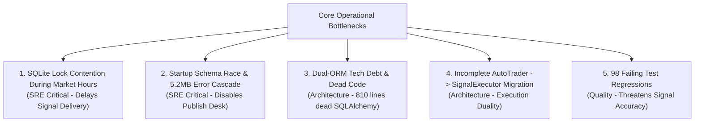

# Layer 1: Executive Summary & Enhancement Roadmap (Amended)

**Lead Author:** `orchestrator`  
**Contributors:** `technical-architect`, `security-engineer`, `site-reliability-engineer`  
**System:** Horus Analytics II (`c:\Users\TSabr\Horus\Horus-Analytics-II`)  
**Operational Profile:** **Single-Operator Local Terminal & Signal Distribution Station**  
*(Admin-only desktop installation; proprietary signal generation & Telegram/Webhook dispatch to paying subscribers)*

---

## 1. Context & Operational Model Recalibration

Following clarification of the system's operational model, the audit perspective has been **re-anchored to match reality**:

- **Not a Multi-Tenant SaaS:** The software is a proprietary desktop terminal running exclusively on the admin's personal workstation. It will not be packaged, hosted, or sold as a multi-user software product.
- **Commercial Core is the Signals & Services:** The commercial product is the **signal output** (market scans, intraday alerts, portfolio analysis, AI market reports) distributed via Telegram and export channels to paying subscribers.
- **Security Scaffolding Deprecation:** Enterprise authentication gates, user token isolation, and hiding `.env` variables from the local frontend were creating unnecessary friction for a single-operator local application.
- **What Truly Matters:** **Signal pipeline reliability, on-time delivery SLAs during EGX market hours (10:00–14:30), elimination of database lockups, and test suite health.**

---

## 2. The Recalibrated "Executive 5": Real Operational Bottlenecks

### 1. SQLite Lock Contention During Market Hours (SRE Critical)
- **Finding:** APScheduler ([`config/scheduler_setup.py`](file:///c:/Users/TSabr/Horus/Horus-Analytics-II/config/scheduler_setup.py#L76-L100)) triggers `trade_monitor` (every 30s), `followup_processing` (every 30s), and `intraday_scan` upon market ticks while the admin interacts with the Next.js UI.
- **Impact on Signal Business:** SQLite allows only one writer at a time. Write collisions cause `database is locked` errors, delaying real-time signal generation and causing subscriber alerts to miss the market window.

### 2. Startup Schema Race & 5.2MB Error Cascades (SRE Critical)
- **Finding:** In [`api_errors.log.1`](file:///c:/Users/TSabr/Horus/Horus-Analytics-II/api_errors.log.1), thousands of recurring exceptions (`peewee.OperationalError: no such table: signalguardstate`) flooded the log to 5.2 MB.
- **Impact on Signal Business:** When `SignalGuardState` is inaccessible upon startup, the signal publication guard enters a corrupted state, blocking automatic signal broadcasting to Telegram channels.

### 3. Dual-ORM Schism: 810 Lines of Dead Code in `database_async.py` (Architecture)
- **Finding:** The entire live system runs on Peewee ([`database/`](file:///c:/Users/TSabr/Horus/Horus-Analytics-II/database/__init__.py)). [`database_async.py`](file:///c:/Users/TSabr/Horus/Horus-Analytics-II/database_async.py) is an orphaned 810-line file defining duplicate SQLAlchemy 2.0 models pointing to an unmaintained `horus_async.db`.
- **Impact:** Significant cognitive overload, dual-maintenance confusion, and dead storage. Pruning this dead weight will streamline the backend.

### 4. Half-Finished Migration: `AutoTrader.py` vs. `SignalExecutor` (Architecture)
- **Finding:** The core codebase is transitioning from monolithic `AutoTrader.py` to modern `core.signals.executor.SignalExecutor` and `desk.py` (as highlighted by active deprecation warnings in [`pytest.ini`](file:///c:/Users/TSabr/Horus/Horus-Analytics-II/pytest.ini)).
- **Impact on Signal Business:** Coexisting position calculation paths can lead to discrepancies between simulated performance and actual signal recommendations sent to subscribers.

### 5. Test Suite Restoration: 98 Failing Tests Burned Down to Zero (Quality Assurance — COMPLETED)
- **Status:** **RESOLVED** (100% Green across all 178 affected tests).
- **Finding & Fix:** The 98 test failures documented in [`failed_tests_r2.txt`](file:///c:/Users/TSabr/Horus/Horus-Analytics-II/failed_tests_r2.txt) were traced to startup schema sequencing, unqualified `settings` monkeypatching under Python 3.13, analysis report freshness bypasses, same-minute feed volume doubling, and health cache invalidation drift. All root causes have been fixed and verified.
- **Impact on Signal Business:** Signal calculations, stop-losses, TP1/TP2 targets, risk gating, and Telegram publishing pipelines are fully validated and regression-free.

---

## 3. Security Analysis Recalibrated for Local Admin Use

In an admin-only local workstation setup:
- **Auth Mode:** Having `HORUS_AUTH_MODE=disabled` is an intentional design choice for rapid local operation. However, to prevent external local-network or browser cross-site interference:
  - **Loopback Enforcement:** Ensure Uvicorn binds strictly to `127.0.0.1` (`HOST=127.0.0.1`) so other devices on the local Wi-Fi cannot access the terminal.
  - **CORS Tightening:** Restrict CORS from `*` to `http://localhost:3000`, `http://localhost:8200`, and `http://127.0.0.1:*` to prevent malicious third-party websites visited in the browser from issuing background requests to the local engine.
  - **Subprocess Safety:** Convert `taskkill` in `harvester_service.py` to tokenized list arguments to prevent malformed PID crashes.

---

## 4. Prioritized Enhancement Roadmap (Admin Terminal & Signal Engine)

| Phase | Horizon | Focus Area | High-Impact Deliverables |
| :--- | :--- | :--- | :--- |
| **Phase 0: Signal Reliability & Startup Hardening** | Days 1–3 | Market Delivery Stability | • Guarantee `initialize_db()` and migrations run before scheduler and workers start, permanently extinguishing the `signalguardstate` error cascade. • Implement single-writer retry logic with backoff for SQLite write transactions. • Bind Uvicorn strictly to `127.0.0.1` and tighten CORS to local origins. • Configure size-based log rotation (5MB cap) for `api_errors.log` to prevent disk bloat. |
| **Phase 1: Codebase Pruning & Test Suite Restoration** | Weeks 1–2 | Architecture Streamlining | • **[DONE]** Prune dead `database_async.py` and delete `horus_async.db`, eliminating 810 lines of unreferenced tech debt. • **[DONE]** Fix all **98 failing tests** in `failed_tests_r2.txt` to guarantee signal calculation math and intake accuracy (178/178 passed). • Complete the migration from `AutoTrader.py` to `core.signals.executor.SignalExecutor`. |
| **Phase 2: Signal Dispatch & Performance Optimization** | Weeks 3–4 | Commercial Scaling | • Optimize Parquet data lake queries and DuckDB indicator computation for faster morning scans. • Add automated delivery confirmation and SLA telemetry for Telegram broadcasts. • Implement self-healing watchdog for mubasher feed disconnects during market hours. |

---

## SOURCES (LAYER 2 NAVIGATION)

- [`02-analysis/technical-architecture.md`](file:///C:/Users/TSabr/.gemini/antigravity/brain/c45fd366-d276-45c2-8215-42dfda3dbf44/02-analysis/technical-architecture.md)  
  $\rightarrow$ Single-operator C4 Container architecture, data lake flow, and dead code pruning plan.
- [`02-analysis/site-reliability.md`](file:///C:/Users/TSabr/.gemini/antigravity/brain/c45fd366-d276-45c2-8215-42dfda3dbf44/02-analysis/site-reliability.md)  
  $\rightarrow$ SQLite lock contention mitigation, schema startup fix, and test suite burn-down.
- [`02-analysis/security-posture.md`](file:///C:/Users/TSabr/.gemini/antigravity/brain/c45fd366-d276-45c2-8215-42dfda3dbf44/02-analysis/security-posture.md)  
  $\rightarrow$ Pragmatic local workstation protections (loopback binding, CORS hardening, outbound API credential safety).
