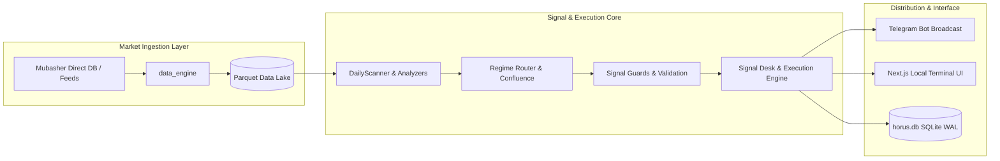

# Layer 2: Technical Architecture Analysis (Amended)

**Author:** `technical-architect`  
**System:** Horus Analytics II (`c:\Users\TSabr\Horus\Horus-Analytics-II`)  
**Context:** **Single-Operator Trading Workstation & Signal Distribution Engine**

---

## 1. System Topology & Value Stream

The architecture is designed to support high-conviction market analysis and signal distribution for the Egyptian Stock Exchange (EGX):



---

## 2. Structural Simplification: Pruning the Dual-ORM Tech Debt

The single highest-leverage architectural cleanup is **retiring `database_async.py`**:

### The Problem:
- [`database_async.py`](file:///c:/Users/TSabr/Horus/Horus-Analytics-II/database_async.py) spans **810 lines** defining duplicate SQLAlchemy 2.0 async models.
- It connects to `horus_async.db`, a 270KB database file that receives zero reads and zero writes.
- None of the 22 route files in `routes/` or services in `core/` import it.
- Meanwhile, the entire live system successfully relies on Peewee ([`database/`](file:///c:/Users/TSabr/Horus/Horus-Analytics-II/database/__init__.py)) and `horus.db`.

### The Action:
- Since this is an admin-operated local desktop terminal, having two full ORM schemas introduces confusion and maintenance overhead without providing any operational benefit.
- **Recommendation:** Formally archive or delete `database_async.py` and delete `horus_async.db`. This eliminates 810 lines of unmaintained code and standardizes the entire codebase on the proven `database/` Peewee layer.

---

## 3. Completing the Core Execution Modernization

Inspection of [`pytest.ini`](file:///c:/Users/TSabr/Horus/Horus-Analytics-II/pytest.ini#L11-L14) highlights active deprecation warnings across four key trading calls:
```ini
filterwarnings =
    ignore:AutoTrader\.process_scanner_signals is deprecated\. Use core\.signals\.executor\.SignalExecutor instead\.:DeprecationWarning
    ignore:execute_run_for_horus is deprecated\. Use core\.signals\.executor\.SignalExecutor instead\.:DeprecationWarning
    ignore:execute_pending_daily_entries_for_horus is deprecated\. Use core\.signals\.executor\.SignalExecutor instead\.:DeprecationWarning
    ignore:monitor_horus_positions is deprecated\. Use core\.signals\.system_monitor\.monitor_system_positions instead\.:DeprecationWarning
```

### Assessment:
- The legacy monolithic [`core/AutoTrader.py`](file:///c:/Users/TSabr/Horus/Horus-Analytics-II/core/AutoTrader.py) (29 KB) is being superseded by the modular signals subsystem:
  - [`core/signals/executor.py`](file:///c:/Users/TSabr/Horus/Horus-Analytics-II/core/signals/executor.py)
  - [`core/signals/desk.py`](file:///c:/Users/TSabr/Horus/Horus-Analytics-II/core/signals/desk.py)
  - [`core/signals/system_monitor.py`](file:///c:/Users/TSabr/Horus/Horus-Analytics-II/core/signals/system_monitor.py)
- **Recommendation:** Refactor remaining callers to use `SignalExecutor` directly, allowing `AutoTrader.py` to be deprecated cleanly. This ensures consistent trade calculation and signal attribution across the local terminal.

---

## SOURCES (LAYER 3 NAVIGATION)

- [`03-dossiers/component-inventory.md`](file:///C:/Users/TSabr/.gemini/antigravity/brain/c45fd366-d276-45c2-8215-42dfda3dbf44/03-dossiers/component-inventory.md)  
  $\rightarrow$ Module map, lines of code, and ORM schema comparison.
- [`03-dossiers/reliability-telemetry.md`](file:///C:/Users/TSabr/.gemini/antigravity/brain/c45fd366-d276-45c2-8215-42dfda3dbf44/03-dossiers/reliability-telemetry.md)  
  $\rightarrow$ Telemetry on execution calls and background job overlap.
