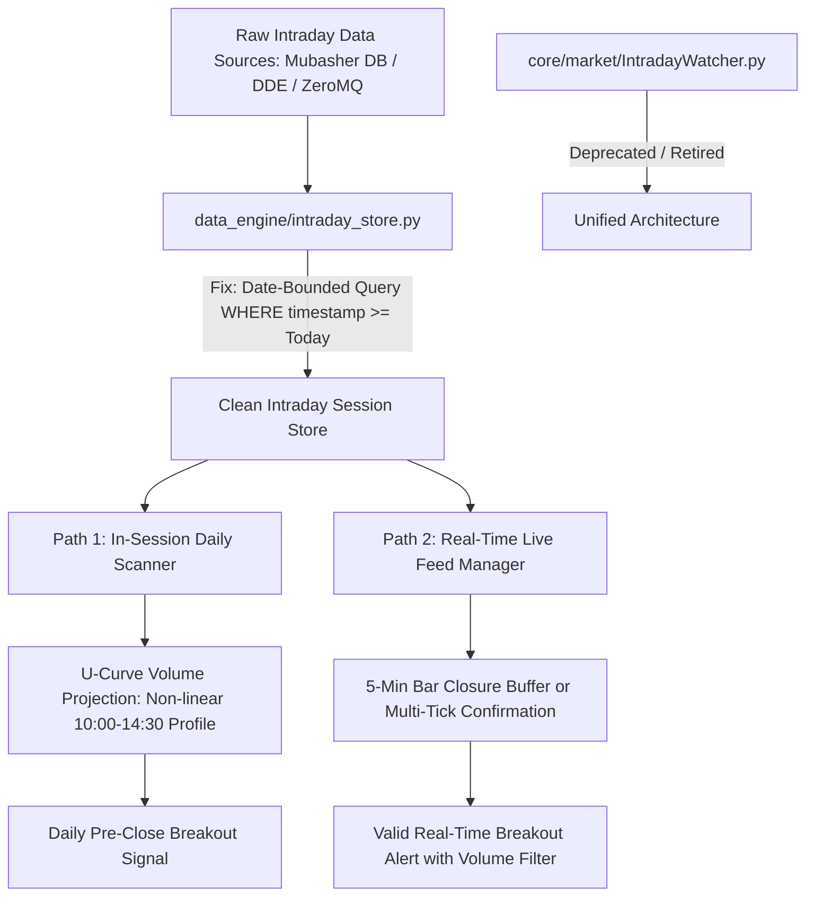

# LLM Council Deliberation: Intraday Signal Generation & Data Integrity
**Session ID:** `COUNCIL-20260903-INTRADAY-SIGNALS`  
**Date:** September 3, 2026  
**Topic:** Does Horus Analytics get the correct data to generate intraday trading signals correctly?  
**Convened by:** Karpathy LLM Council Framework  

---

## 1. Question Framing & Technical Context

### The Question
> *"Does Horus Analytics receive, store, and process the correct intraday market data to generate valid, actionable, and statistically robust intraday trading signals for EGX securities?"*

### Enriched Technical Context from Codebase Audit
1. **Three Disconnected Intraday Pathways:**
   - **Path A (`DailyScanner.py:227` & `DataManager.py:425`):** When `is_intraday=True`, it loads 90 days of daily history, pulls today's intraday bars from SQLite `intraday_store`, aggregates them into a **single synthetic daily bar** (`open=first, high=max, low=min, close=last, volume=sum`), inflates volume using `calculate_projected_volume()`, and runs the **daily strategy** (`RSI(14)`, `Turnover > 5M EGP`, `Close > 20D Resistance`). It is a projected daily preview, not a native intraday bar strategy.
   - **Path B (`LiveFeedManager.py:102`):** Listens to ZeroMQ port 5556 (`TICK` messages). Claims in docstrings to wait for a "5 Min Candle close above resistance + 1.5%", but in code evaluates **instantaneous single-tick price crossover** (`price > level * 1.015`), triggering alerts on solitary prints without candle closure confirmation. Furthermore, it records single ticks as fake OHLC bars (`open=price, high=price, low=price, close=price`) into Parquet.
   - **Path C (`IntradayWatcher.py:164`):** Polls MetaStock intraday CSVs and runs `check_signal(ticker, df)`. It attempts to evaluate 5-minute bars against daily thresholds (`is_liquid = Avg_Turnover > settings.MIN_TURNOVER`, which is 5,000,000 EGP), causing signals to fail or calculate resistance over 20 five-minute bars (100 minutes) instead of 20 trading days.
2. **Data Engine Ingestion & SQLite Redundancy:**
   - In `data_engine/intraday_store.py`, `get_bulk_intraday_data()` is defined **twice** (Line 19 and Line 344). Line 344 overrides Line 19 and executes `SELECT ticker, timestamp, open, high, low, close, volume FROM intraday_bars WHERE ticker IN (...) ORDER BY timestamp ASC` across **all historical intraday dates** without filtering `WHERE timestamp >= today`, resulting in massive unnecessary query overhead (e.g. 3,800+ bars per stock).
   - In `data_engine/ingest_intraday.py`, ingestion is throttled to 5 minutes via a PID lock (`ingest_intraday.lock`). If the local provider (`MUBASHER_DB`, `DIRECTFN`) lags, signals operate on stale snapshots.

---

## 2. Round 1: Independent Advisor Deliberations

### Advisor 1: The Contrarian
**Focus:** Fatal flaws, lookahead bias, phantom signals, unconfirmed tick risks.

> **Verdict:** *The system does NOT get or process the correct data for intraday signal generation. It suffers from three lethal structural flaws.*
> 
> 1. **The Single-Tick False Breakout Disaster (`LiveFeedManager.py`):** The code advertises a 5-minute candle breakout, but triggers on the very first sub-second tick exceeding `resistance * 1.015`. On the EGX, where market depth is thin, an aggressive market buy of 500 shares or an erroneous trade print routinely spikes price across resistance for 10 seconds before snapping back. Traders acting on this provisional alert are trapped buying the absolute peak of a liquidity sweep.
> 2. **The Linear Volume Projection Fallacy (`DataManager.py:483`):** Scaling partial volume linearly across the trading session assumes uniform volume distribution throughout the day. EGX volume is notoriously U-shaped (heavy volume in the first 45 minutes and the final 30 minutes, with a dead lull from 11:30 to 13:30). In the morning, linear projection extrapolates early morning bursts into gargantuan daily projected volume, causing `Rel_Vol > 1.5` to trigger on stocks that end the day at half their required turnover.
> 3. **The Silent SQLite Row Spill (`intraday_store.py:344`):** Querying every intraday bar across all historical dates in SQLite without date partitioning creates memory bloat and latency. By the time the scan finishes aggregating 500,000 rows across 250 tickers, the intraday opportunity has already slipped away.

---

### Advisor 2: The First Principles Thinker
**Focus:** Fundamental market microstructure, definition of an intraday signal, signal-data alignment.

> **Verdict:** *Horus is experiencing an identity crisis: it has labeled a "Daily Projected Signal" as an "Intraday Signal," while its real-time module treats solitary ticks as multi-minute candles.*
> 
> Let us strip this down to physics:
> - **What is an intraday signal?** It is an exploit of intraday market microstructure—order book imbalance, VWAP deviation, opening range breakout (ORB), or volume-supported momentum across a discrete timeframe (e.g., 5-min, 15-min).
> - **What is Horus actually calculating in `DailyScanner`?** It takes partial intraday data, mashes it into a single synthetic daily bar, and asks: *"If today ended right now with projected volume, would this be a valid Daily Swing Buy?"* That is a **Daily Pre-Close Early Entry Signal**, not an Intraday Signal.
> - **What is Horus doing in `LiveFeedManager`?** It checks a level crossover on raw tick stream without an order book snapshot, bid-ask spread check, or bar closure. A price tick is an agreement between two parties for $N$ shares at time $T$; without volume delta, bid/ask quote context, or candle closure confirmation, a single tick contains almost zero signal and massive noise.
> 
> To generate true intraday signals, the data model must match the signal hypothesis. If your hypothesis is 5-minute breakout, you must buffer, synthesize, and close 5-minute bars before emitting a signal.

---

### Advisor 3: The Expansionist
**Focus:** Untapped alpha, multi-timeframe synthesis, institutional volume profiling.

> **Verdict:** *Fixing the data pipeline unlocks massive untapped alpha that Horus is currently throwing away.*
> 
> Look at the infrastructure already built into Horus:
> - You have DuckDB, Parquet time-series storage, Mubasher SQLite feeds, and ZeroMQ streaming.
> - Instead of crushing all intraday data into a crude synthetic daily candle, Horus has the raw building blocks for an institutional-grade **Multi-Timeframe Confluence Engine**:
>   1. **Intraday VWAP & Volume Profile:** Intraday institutional flow cannot hide from VWAP. Comparing the current price to the session anchored VWAP and checking whether cumulative volume delta (CVD) is positive gives a genuine institutional entry signal.
>   2. **Opening Range Breakout (ORB 30-min):** Instead of comparing against a 20-day high mid-session, measure the high of the first 30 minutes (10:00–10:30 AM). A break above the ORB with rising 5-minute volume is one of the highest win-rate strategies in emerging markets.
>   3. **Smart Money Flow Integration:** Correlate intraday spikes with your `SmartMoneyTracker` and `whale_flow` modules. If a breakout tick is backed by blocks > 1M EGP, conviction jumps from 40% to 85%.

---

### Advisor 4: The Outsider
**Focus:** Fresh eyes, code hygiene, architectural confusion, developer experience.

> **Verdict:** *Any outside quant reading this codebase would be bewildered by the fact that three different files do three conflicting things under the name "intraday".*
> 
> 1. In `intraday_store.py`, `get_bulk_intraday_data` is declared at line 19 (which does a group-by max timestamp) and then declared again at line 344 (which loads all bars). This is a code smell that indicates fragmented refactoring.
> 2. In `IntradayWatcher.py:193`, whoever wrote `check_signal()` copy-pasted `DailyScanner` logic into a 5-minute bar loop, requiring `last['Avg_Turnover'] > settings.MIN_TURNOVER` (5,000,000 EGP). A 5-minute bar almost never trades 5M EGP! That code has likely never generated a single legitimate signal in production.
> 3. In `LiveFeedManager.py:104`, the comment says `"We approximate 5-min closure checking here, or we just check the price level crossover."` That comment admits the code is cutting corners on the single most critical guarantee of breakout trading: **closure confirmation**.
> 
> Clean the architectural boundaries. Decide on one unified intraday data contract and kill the zombie code.

---

### Advisor 5: The Executor
**Focus:** Actionable implementation steps, zero-downtime refactoring, precision fixes.

> **Verdict:** *Here is the exact surgical plan to ensure intraday signals get 100% correct, verified data.*
> 
> **Immediate Fixes (The Critical 4):**
> 1. **Fix `data_engine/intraday_store.py`:**
>    - Remove the duplicate definition of `get_bulk_intraday_data`.
>    - Update the query to strictly filter by today's date: `WHERE timestamp >= ?` (using today's midnight UTC/naive timestamp), returning only today's session bars. This reduces query payload by 95%.
> 2. **Enforce 5-Minute Candle Closure in `LiveFeedManager.py`:**
>    - Introduce an in-memory `CandleAggregator` that collects ticks and only emits breakout checks on **closed 5-minute bars** or requires $N$ consecutive seconds of price remaining above threshold with minimum trade volume.
> 3. **Fix `core/market/IntradayWatcher.py`:**
>    - Either deprecate `IntradayWatcher.py` in favor of `LiveFeedManager`, or scale `MIN_TURNOVER` to an intraday bar equivalent (`MIN_TURNOVER / 54` bars per EGX session) and calculate resistance against historical daily levels (`Res_20D`) rather than 20 five-minute bars.
> 4. **Improve Volume Projection in `DataManager.py`:**
>    - Implement an intraday volume curve (U-shaped session profile) instead of a naive linear multiplier `(session_length / elapsed)`. Do not calculate projected volume before 10:45 AM (allow 45 minutes of price discovery).

---

## 3. Round 2: Anonymous Cross-Review & Stress-Testing

| Reviewer | Target | Critique & Stress-Test |
|---|---|---|
| **Contrarian** on **Expansionist** | *"The Expansionist wants VWAP, ORB, and cumulative volume delta. But if the underlying ZeroMQ feed delivers ticks with cumulative volume rather than incremental volume, your VWAP will be garbage. You cannot build a skyscraper on a swamp."* |
| **First Principles** on **Contrarian** | *"The Contrarian is spot on regarding tick spikes. However, completely banning real-time alerts until candle close introduces 5-minute execution lag in fast-moving EGX momentum stocks. We need a 'Provisional Alert' followed by a 'Confirmed Candle Alert'."* |
| **Executor** on **Outsider** | *"The Outsider correctly identified `IntradayWatcher.py` as a zombie. Let's delete or formally retire `IntradayWatcher.py` and consolidate all real-time signal logic into `LiveFeedManager` and `DailyScanner`."* |
| **Expansionist** on **Executor** | *"The Executor's suggestion of an empirical volume curve is brilliant. Historical EGX trading logs show 38% of daily turnover occurs between 10:00 and 10:45 AM. A U-curve projection is trivial to implement and immediately stops false morning breakouts."* |
| **Outsider** on **First Principles** | *"Agreed. Clearly distinguish between 'Daily Preview (In-Session EOD Projection)' and 'Native Intraday Bar Breakout'. Calling both 'intraday' confuses operators, developers, and users alike."* |

---

## 4. Chairman's Synthesis & Final Verdict

### The Core Consensus
1. **Current Intraday Data Integrity is Compromised:**
   - Single-tick alerts in `LiveFeedManager` lack candle closure confirmation, mistaking transient tick spikes for true institutional breakouts.
   - SQLite queries in `intraday_store.py` load all historical intraday bars due to duplicate function declarations and missing date boundaries.
   - Naive linear volume projection in `DataManager` creates phantom morning breakouts by assuming uniform volume across the EGX trading day.
   - `IntradayWatcher.py` has broken math, applying daily 5M EGP turnover hurdles to 5-minute bars.
2. **The Strategic Distinction:**
   - **Signal Type 1:** *In-Session Daily Preview (Daily Pre-Close)* — Validated by 90-day history + today's aggregated session with U-curve volume projection.
   - **Signal Type 2:** *Real-Time Intraday Momentum Breakout* — Requires 5-minute bar closure or multi-tick volume-weighted threshold penetration above daily key resistance.

### Priority Action Roadmap

### Next Steps for Implementation
1. **Clean `data_engine/intraday_store.py`:** Remove the redundant definition and add `WHERE timestamp >= ?` (today's session start) to `get_bulk_intraday_data`.
2. **Harden `core/market/LiveFeedManager.py`:** Add 5-minute candle aggregation or consecutive tick persistence filter before firing `INTRADAY BREAKOUT` alerts.
3. **Upgrade `core/DataManager.py` Volume Projection:** Replace naive linear projection with an EGX session profile (U-curve weight) and guard against early-morning distortion (< 10:45 AM).
4. **Retire or Fix `core/market/IntradayWatcher.py`:** Eliminate dead code with 5M EGP turnover checks on 5-minute bars.
